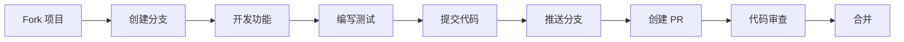

# 贡献指南

## 🤝 欢迎贡献

感谢您对 SealDice UI 项目的关注！我们欢迎所有形式的贡献，无论是代码、文档、设计还是建议。

## 📋 贡献前准备

### 了解项目

- 阅读 [项目概述](./README.md)
- 了解 [技术架构](./architecture.md)
- 查看 [开发指南](./development.md)
- 熟悉 [代码规范](#代码规范)

### 环境准备

1. Fork 项目到你的 GitHub 账号
2. 克隆你的 Fork 仓库
3. 设置上游仓库
4. 创建开发分支

```bash
# 克隆你的 Fork
git clone git@github.com:your-username/sealdice-ui.git
cd sealdice-ui

# 添加上游仓库
git remote add upstream https://github.com/sealdice/sealdice-ui.git

# 创建开发分支
git checkout -b feature/your-feature-name
```

## 🚀 贡献流程

### 1. 选择贡献类型

#### 🐛 Bug 修复
- 在 Issues 中查找标记为 `bug` 的问题
- 或提交新的 Bug 报告

#### ✨ 新功能
- 查看标记为 `enhancement` 的 Issue
- 提出新功能建议

#### 📝 文档改进
- 修正错误或过时的文档
- 添加示例和说明
- 翻译文档

#### 🎨 UI/UX 改进
- 优化界面设计
- 改善用户体验
- 修复样式问题

### 2. 开发流程



### 3. 提交代码

#### 提交前检查

```bash
# 运行类型检查
pnpm run type-check

# 运行代码检查
pnpm run lint

# 运行所有检查
pnpm run check

# 构建测试
pnpm run build
```

#### Commit 规范

我们使用 [Conventional Commits](https://www.conventionalcommits.org/) 规范：

```
<type>(<scope>): <subject>

<body>

<footer>
```

**Type 类型**：

| Type | 说明 | 示例 |
|------|------|------|
| feat | 新功能 | `feat(api): 添加用户认证接口` |
| fix | Bug 修复 | `fix(ui): 修复按钮点击无响应问题` |
| docs | 文档更新 | `docs: 更新 API 文档` |
| style | 代码格式 | `style: 格式化代码` |
| refactor | 重构 | `refactor(store): 重构状态管理` |
| perf | 性能优化 | `perf: 优化列表渲染性能` |
| test | 测试 | `test: 添加单元测试` |
| build | 构建系统 | `build: 更新 webpack 配置` |
| ci | CI 配置 | `ci: 添加 GitHub Actions` |
| chore | 其他修改 | `chore: 更新依赖版本` |

**提交示例**：

```bash
# 功能提交
git commit -m "feat(connection): 添加 Discord 平台支持"

# Bug 修复
git commit -m "fix(home): 修复日志自动刷新失效问题"

# 带详细说明的提交
git commit -m "refactor(api): 重构 API 请求层

- 统一错误处理
- 添加请求重试机制
- 优化类型定义

Closes #123"
```

### 4. 创建 Pull Request

#### PR 标题格式

```
<type>: <description>
```

例如：
- `feat: 添加暗色主题支持`
- `fix: 修复移动端布局问题`
- `docs: 完善部署文档`

#### PR 描述模板

```markdown
## 描述
简要描述这个 PR 的目的和改动内容

## 改动类型
- [ ] Bug 修复
- [ ] 新功能
- [ ] 文档更新
- [ ] 性能优化
- [ ] 代码重构

## 相关 Issue
Closes #xxx

## 截图（如果涉及 UI 改动）
添加改动前后的截图对比

## 测试
- [ ] 本地测试通过
- [ ] 构建成功
- [ ] 代码检查通过

## 其他说明
需要特别注意的事项
```

## 📏 代码规范

### TypeScript 规范

```typescript
// ✅ 好的示例
interface UserConfig {
  id: string
  name: string
  enable?: boolean
}

export const getUserConfig = async (id: string): Promise<UserConfig> => {
  const response = await api.get<UserConfig>(`/user/${id}`)
  return response.data
}

// ❌ 避免
export const getUserConfig = async (id: any) => {
  const response = await api.get(`/user/${id}`)
  return response.data
}
```

### Vue 组件规范

```vue
<!-- ✅ 推荐的组件结构 -->
<template>
  <div class="component-name">
    <!-- 模板内容 -->
  </div>
</template>

<script setup lang="ts">
// 1. 导入
import { ref, computed } from 'vue'
import type { UserConfig } from '~/types'

// 2. Props 定义
interface Props {
  config: UserConfig
  disabled?: boolean
}

const props = withDefaults(defineProps<Props>(), {
  disabled: false
})

// 3. Emits 定义
const emit = defineEmits<{
  'update:config': [value: UserConfig]
  'submit': []
}>()

// 4. 响应式数据
const loading = ref(false)

// 5. 计算属性
const isValid = computed(() => {
  return props.config.name.length > 0
})

// 6. 方法
const handleSubmit = async () => {
  // 处理逻辑
}

// 7. 生命周期
onMounted(() => {
  // 初始化
})
</script>

<style scoped>
/* 组件样式 */
</style>
```

### CSS/样式规范

```css
/* 使用 Tailwind CSS 类 */
<div class="flex items-center gap-4 p-4">

/* 自定义样式使用 scoped */
<style scoped>
.custom-component {
  /* BEM 命名规范 */
  &__header {
    /* ... */
  }
  
  &__body {
    /* ... */
  }
  
  &--active {
    /* ... */
  }
}
</style>
```

### 文件命名规范

```
src/
├── components/
│   ├── PageHome.vue          # 页面组件：PascalCase
│   ├── BanList.vue           # 功能组件：PascalCase
│   └── utils/
│       └── diff-viewer.vue   # 工具组件：kebab-case
├── api/
│   └── dice/
│       └── index.ts          # API 模块：index.ts
├── store/
│   └── index.ts              # Store：index.ts
└── utils.ts                  # 工具函数：kebab-case
```

## 🧪 测试指南

### 单元测试

```typescript
// example.spec.ts
import { describe, it, expect } from 'vitest'
import { mount } from '@vue/test-utils'
import Component from './Component.vue'

describe('Component', () => {
  it('should render correctly', () => {
    const wrapper = mount(Component, {
      props: {
        title: 'Test Title'
      }
    })
    
    expect(wrapper.text()).toContain('Test Title')
  })
})
```

### E2E 测试

```typescript
// e2e/example.spec.ts
import { test, expect } from '@playwright/test'

test('homepage should load', async ({ page }) => {
  await page.goto('/')
  await expect(page).toHaveTitle(/SealDice/)
})
```

## 📚 文档贡献

### 文档结构

```
docs/
├── index.md          # 文档首页
├── README.md         # 项目概述
├── development.md    # 开发指南
├── api.md           # API 文档
└── ...
```

### 文档编写规范

1. 使用 Markdown 格式
2. 包含目录（使用 ## 标题）
3. 提供代码示例
4. 添加必要的图表
5. 保持简洁清晰

## 🌍 国际化贡献

### 添加新语言

1. 在 `src/locales` 创建语言文件
2. 翻译所有文本内容
3. 在配置中注册语言
4. 测试语言切换

## 🎯 贡献重点领域

### 当前需要帮助的领域

- 📱 移动端适配优化
- 🌐 国际化支持
- ♿ 无障碍功能
- 📊 性能优化
- 📝 文档完善
- 🧪 测试覆盖

### 新手友好的任务

查找标记为 `good first issue` 的 Issue，这些通常是：
- 简单的 Bug 修复
- 文档更新
- 代码格式化
- 小功能添加

## 🏆 贡献者指南

### 成为核心贡献者

持续贡献高质量代码，可以：
- 获得直接提交权限
- 参与项目决策
- 获得贡献者标识

### 行为准则

- 尊重所有参与者
- 建设性地提出批评
- 接受不同的观点
- 专注于项目目标
- 保持专业态度

## ❓ 获取帮助

### 开发问题

- 查看 [开发文档](./development.md)
- 搜索现有 Issues
- 在 Discussions 提问

### 联系方式

- GitHub Issues: 技术问题和 Bug 报告
- GitHub Discussions: 功能讨论和建议
- 官方交流群: 即时交流和求助

## 📄 许可证

贡献的代码将遵循项目的开源许可证。提交 PR 即表示您同意将代码以相同的许可证发布。

## 🙏 致谢

感谢所有贡献者的付出！你们的贡献让 SealDice 变得更好。

### 贡献者列表

<!-- ALL-CONTRIBUTORS-LIST:START -->
<!-- ALL-CONTRIBUTORS-LIST:END -->

---

> 💪 **加入我们**：无论您是经验丰富的开发者还是刚开始编程之旅，我们都欢迎您的贡献。每一份贡献都很重要！